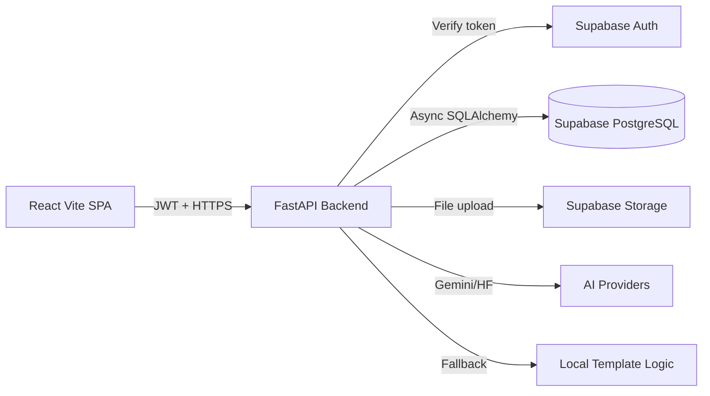

# AI Hiring OS

AI Hiring OS is a multi-tenant recruiting and HRMS platform for companies that need candidate screening, AI interviews, employee management, attendance, performance reviews, and attendance-driven payroll in one product.

The current implementation is a React/Vite frontend backed by a FastAPI API. Authentication is handled through Supabase Auth, application data is stored in Supabase PostgreSQL, and the backend enforces tenant isolation through `company_id` checks on every business module.

## Implemented Modules

| Area | Implemented Capability |
|---|---|
| Authentication | Login/signup through Supabase Auth, JWT verification, local user synchronization, company registration validation |
| Roles | Admin, HR, Manager, Employee route protection and backend RBAC |
| Company Settings | Company profile edit/read, manager and employee read-only behavior where applicable |
| Jobs | HR/Admin job creation and company-scoped job listing |
| Candidates | Bulk PDF resume upload, Supabase Storage upload, background extraction, AI scoring, candidate list by job |
| AI Screening | Resume parsing, skill match score, semantic score, overall score, summary/explanation, matched/missing skills |
| AI Interview | Question generation, browser speech-to-text capture, transcript recording, AI evaluation, recommendation, interview analytics |
| Voice AI Interviews | AssemblyAI audio upload/transcription, voice metrics, transcript persistence, browser speech fallback |
| Employees | Employee directory, department filtering, HR/Admin create/update/delete, manager team visibility, employee self visibility |
| Attendance | Clock in/out, total hour calculation, present/half-day/absent status, own/team/company views |
| Performance | Manager reviews, employee review history, team reviews, company analytics |
| Payroll | Generate payroll from attendance, HR approval, paid status, employee payslip history, PDF-ready payslip, AI payroll insight |
| Realtime | Tenant-scoped FastAPI WebSockets for resume, score, interview, and payroll events |
| Dashboards | Role-specific HR, Manager, and Employee dashboards with recruitment and HRMS widgets |

## Architecture



## Tech Stack

| Layer | Technology |
|---|---|
| Frontend | React 19, Vite 6, React Router, Tailwind CSS v4, Framer Motion, Lucide React |
| Backend | FastAPI, Uvicorn, SQLAlchemy async, Pydantic v2 |
| Database | Supabase PostgreSQL with asyncpg |
| Auth | Supabase Auth JWT verification plus local `users` table |
| AI | Gemini API, HuggingFace Router, deterministic template fallback |
| Voice AI | AssemblyAI transcription API with browser speech-recognition fallback |
| File Processing | PyMuPDF for PDF text extraction, Supabase Storage for resume files |
| Deployment | Vercel frontend, AWS EC2 Docker backend, legacy Render config retained |

## Role Matrix

| Role | Primary Screens | Backend Access |
|---|---|---|
| Admin | HR dashboard, jobs, candidates, employees, attendance, performance, payroll, AI interviews, settings | Full company-scoped access |
| HR | HR dashboard, jobs, candidates, employees, attendance, performance, payroll, AI interviews, settings | Full company-scoped HR access |
| Manager | Manager dashboard, jobs, candidates, employees, attendance, performance, payroll, settings | Read candidate/payroll data, manage team reviews and attendance visibility |
| Employee | Employee dashboard, attendance, performance, payroll, settings | Own attendance, performance, payroll, and profile-related data |

## Important API Groups

| Group | Endpoints |
|---|---|
| Auth | `POST /auth/login`, `POST /auth/signup`, `GET /me` |
| Jobs/Candidates | `POST /jobs`, `GET /jobs`, `POST /jobs/{id}/upload-resumes`, `GET /jobs/{id}/candidates` |
| Employees | `GET /employees`, `POST /employees`, `PUT /employees/{id}`, `DELETE /employees/{id}` |
| Attendance | `POST /attendance/clock-in`, `POST /attendance/clock-out`, `GET /attendance/me`, `GET /attendance/team`, `GET /attendance/company` |
| Performance | `POST /performance`, `GET /performance/me`, `GET /performance/team`, `GET /performance/company` |
| Interviews | `POST /interviews/start`, `POST /interviews/{id}/answer`, `POST /interviews/{id}/complete`, `GET /interviews/company/analytics` |
| Payroll | `POST /payroll/generate`, `POST /payroll/generate-all`, `GET /payroll`, `GET /payroll/me`, `PUT /payroll/{id}/approve`, `PUT /payroll/{id}/mark-paid` |

## Local Setup

### Backend

```bash
cd backend
python -m venv venv
venv\Scripts\activate
pip install -r requirements.txt
uvicorn app.main:app --reload
```

Required backend environment variables:

```env
APP_NAME="AI Hiring OS"
APP_ENV=development
DEBUG=true
SUPABASE_URL=
SUPABASE_ANON_KEY=
SUPABASE_SERVICE_ROLE_KEY=
SUPABASE_JWT_SECRET=
DATABASE_URL=
CORS_ORIGINS=http://localhost:5173
AI_GEMINI_KEY=
AI_HF_KEY=
AI_HF_BASE_URL=https://router.huggingface.co/v1
AI_HF_MODEL=meta-llama/Llama-3.1-8B-Instruct
ASSEMBLYAI_API_KEY=
```

### Frontend

```bash
cd frontend
npm install
npm run dev
```

Required frontend environment variable:

```env
VITE_API_BASE_URL=http://127.0.0.1:8000
```

## Production Deployment

The frontend is configured for Vercel through `vercel.json` with `frontend` as the root directory. The backend currently has an AWS EC2 Docker deployment path using `docker-compose.aws.yml`. A legacy `render.yaml` remains in the repository for Render-style backend deployment but the active always-on path is EC2.

## Documentation

| Document | Purpose |
|---|---|
| `docs/PRD.md` | Product requirements and implemented scope |
| `docs/TRD.md` | Technical requirements and service design |
| `docs/UI_UX_DESIGN.md` | UI system, responsiveness, and page design |
| `docs/APP_FLOW.md` | User and system flows |
| `docs/BACKEND_SCHEMA.md` | Database schema and endpoint map |
| `docs/IMPLEMENTATION_PLAN.md` | Completed phases and remaining gaps |
| `docs/TECH_STACK_EXPLAINED.md` | Interview-ready stack explanation |
| `docs/SYSTEM_DESIGN_DEEP_DIVE.md` | End-to-end system design |
| `docs/INTERVIEW_PREPARATION_GUIDE.md` | Product, technical, and HR interview preparation |
| `docs/PROJECT_WALKTHROUGH.md` | Screen-by-screen walkthrough |
| `docs/FWC_REQUIREMENT_MAPPING.md` | FWC requirement compliance mapping |
| `docs/SCALABILITY_REPORT.md` | Locust load-test plan and architecture scaling analysis |
| `docs/ARCHITECTURE_DECISIONS.md` | Architecture decision records |

## Known Limitations

| Limitation | Current State |
|---|---|
| Payroll payments | Payroll records can be generated, approved, and marked paid; no bank transfer integration exists |
| PDF generation | Payslips use browser print/save-as-PDF, not a server-side PDF renderer |
| Background jobs | Resume extraction uses FastAPI `BackgroundTasks`, not a durable queue |
| Migrations | Models are auto-created on startup; Alembic is installed but no formal migration history is maintained |
| Scale testing | Architecture is designed for horizontal scale, but no load-test evidence is included in the repo |

## Enterprise Readiness Upgrades

- AssemblyAI voice interview transcription now stores `interview_transcript`, `interview_metrics`, and `audio_url`.
- FastAPI WebSockets provide tenant-scoped realtime events for resumes, AI scoring, interviews, and payroll.
- Payroll now stores explicit salary components: basic salary, allowances, bonuses, manual deductions, and attendance deductions.
- Locust load tests cover login, candidate listing, resume upload, and payroll retrieval for staged 100/250/500-user validation.
