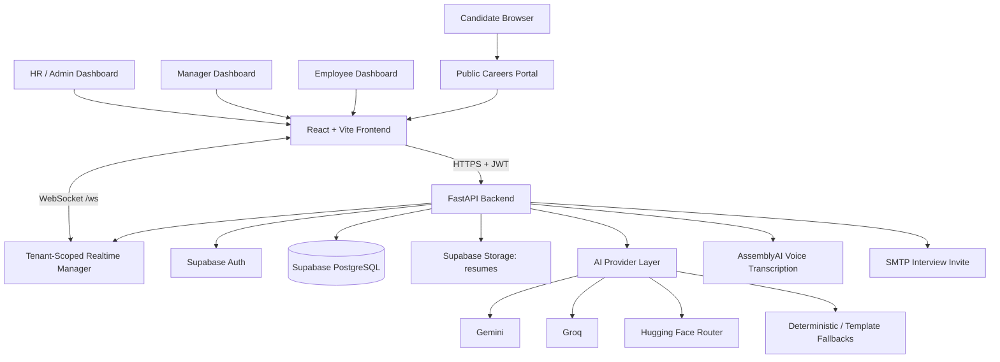
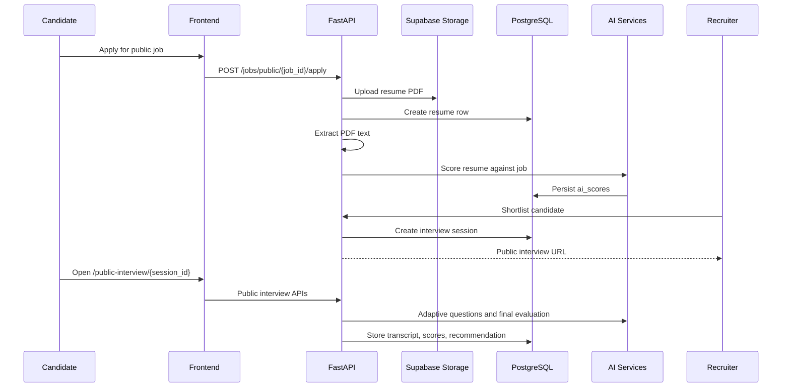
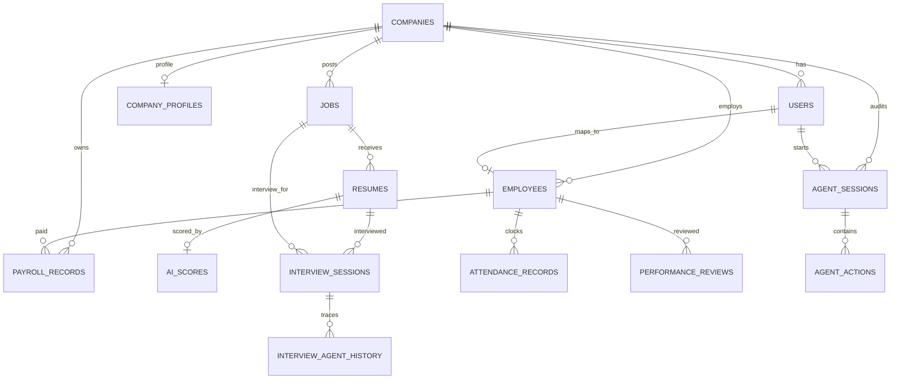
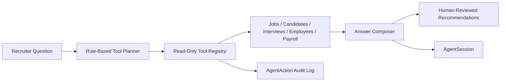
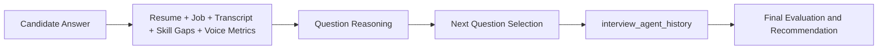
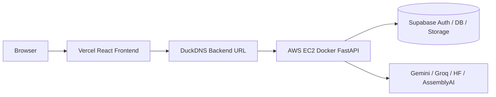

# AI Hiring OS

[](#tech-stack)
[](#tech-stack)
[](#database-overview)
[](#security)
[](#ai-features)
[](#scalability-validation)

AI Hiring OS is an AI-powered HRMS and recruitment platform that combines public candidate applications, resume screening, agentic recruiter assistance, adaptive AI interviews, employee management, attendance, payroll, and performance reviews in one multi-role product.

It is built as a full-stack SaaS-style application with a React/Vite frontend, FastAPI backend, Supabase Auth, Supabase PostgreSQL, Supabase Storage, AssemblyAI voice transcription, Gemini/Groq/Hugging Face AI fallback paths, tenant-scoped WebSockets, and measured Locust scalability results.

## Product Demo

```text
[ DEMO VIDEO ]
```

YouTube: https://YOUR-DEMO-LINK  

## Project Overview

Hiring teams usually work across disconnected tools: job posts in one place, resumes in another, interviews in another, and HR operations in spreadsheets or separate HRMS systems. That creates slow screening, inconsistent candidate evaluation, unclear interview workflows, repeated manual entry, and weak visibility across the employee lifecycle.

AI Hiring OS solves this by bringing recruitment and HR operations into one structured workflow:

1. HR creates open jobs.
2. Candidates apply through a public careers portal.
3. Resumes are uploaded to Supabase Storage.
4. PDF text is extracted with PyMuPDF.
5. The backend scores candidates against job descriptions.
6. Recruiters shortlist candidates.
7. A public AI interview link is generated for shortlisted candidates.
8. Candidates complete adaptive text or voice interviews without an account.
9. HR reviews AI scorecards, transcripts, voice metrics, and recommendations.
10. The same platform manages employee directory, attendance, payroll, and performance after hiring.

The product is designed for HR teams, hiring managers, demo evaluators, and technical interviewers who need to see both a polished product surface and a defensible backend architecture.

## FWC Requirement Mapping

| FWC Requirement | Implementation | Status |
|---|---|---|
| AI Resume Screening | Resume upload, PDF extraction, deterministic scoring, Gemini/Groq/HF AI insights, matched and missing skills | Implemented |
| AI Voice Interaction | AssemblyAI audio transcription, browser speech fallback, voice metrics persisted in interviews | Implemented |
| Multi Role Login | Supabase Auth plus local `users` roles: admin, HR, manager, employee | Implemented |
| Admin Dashboard | Admin uses HR dashboard route with high-privilege access | Implemented |
| Manager Dashboard | Manager dashboard with team, candidate, attendance, and performance visibility | Implemented |
| Employee Dashboard | Employee self-service dashboard for attendance, payroll, and performance | Implemented |
| Attendance | Clock-in/out, daily status, self/team/company analytics | Implemented |
| Payroll | Attendance-linked payroll generation, approval, paid status, employee payslip history | Implemented |
| Performance | Reviews, self history, team review view, company analytics | Implemented |
| Mobile Responsive | React/Tailwind responsive dashboard and public candidate pages | Implemented |
| Deployment | Vercel frontend config and Docker/EC2 backend deployment path | Implemented |
| Agentic AI | Recruiter Copilot tool calling and Adaptive Interview Agent traces | Implemented |
| Real-time Processing | Tenant-scoped FastAPI WebSocket event manager | Implemented |
| Scalability Validation | Locust result CSVs for 100, 250, and 500 users in `load_tests/results/` | Implemented |
| Documentation | Product, technical, backend, AI, scalability, and interview docs under `docs/` | Implemented |

## Features

### Recruitment AI

- Public careers page for open jobs
- Public candidate application flow
- PDF resume upload to Supabase Storage
- Resume text extraction with PyMuPDF
- AI and deterministic resume scoring
- Skill gap analysis
- Candidate ranking by score
- Candidate shortlisting
- Public interview link generation
- Recruiter-facing candidate review dashboard

### Agentic AI

- Recruiter Copilot agent
- Read-only tool calling over jobs, candidates, interviews, employees, and payroll
- Candidate comparison
- Advisory shortlist recommendations
- Interview planning suggestions
- Agent session and tool trace persistence
- Adaptive Interview Agent for next-question selection
- Question-level reasoning stored in `interview_agent_history`

### Voice AI

- AssemblyAI audio upload and transcription
- Browser speech-recognition fallback route
- Voice interview transcript persistence
- Communication score
- Confidence score
- Fluency score
- Speaking pace
- Filler-word analysis

### HRMS

- Employee directory
- Manager hierarchy
- Attendance clock-in/out
- Team attendance
- Company attendance analytics
- Payroll generation
- Payroll approval and paid workflow
- Employee payslip history
- Performance reviews
- Company performance analytics

### Security

- Supabase JWT session tokens
- FastAPI bearer-token verification
- Local app user synchronization
- RBAC for admin, HR, manager, employee
- App-level multi-tenant isolation with `company_id`
- Protected frontend routes
- Tenant-scoped WebSocket connections
- Supabase Auth and Storage integration

## AI Features

| AI Feature | What It Does | Actual Implementation |
|---|---|---|
| Resume Screening | Scores a candidate resume against a job description | `evaluation_service.py`, `ai_service.py`, `scoring_service.py`, `ai_score_service.py` |
| Skill Gap Analysis | Finds matched and missing skills from resume/JD comparison | Stored in `ai_scores.matched_skills` and `ai_scores.missing_skills` |
| Recruiter Copilot Agent | Answers recruiter questions using read-only HR/hiring tools | `/agent/ask`, `agent_service.py`, `agent_tools.py` |
| Adaptive Interview Agent | Chooses the next interview question from resume, job, answers, skill gaps, and voice metrics | `interview_service.generate_next_question`, `interview_ai_service.py` |
| Voice Interview Evaluation | Transcribes voice answers and calculates communication/confidence/fluency metrics | `assemblyai_service.py`, interview voice routes |
| Payroll Insights | Generates payroll summaries through AI provider fallback or template summaries | `payroll_service.py` |

## System Metrics

| Metric | Count | Source |
|---|---:|---|
| Total AI Features | 6 | README AI feature inventory from current services |
| Total Roles | 4 | `backend/app/core/security.py` |
| Total Role Dashboards | 3 | HR/Admin, Manager, Employee dashboards |
| Total HR Modules | 7 | Recruitment, Candidates, Interviews, Employees, Attendance, Payroll, Performance |
| Total API Route Handlers | 59 | `backend/app/api/routes/*.py`, including WebSocket |
| Total Database Tables | 14 | `backend/app/models/*.py` |
| Total Agent Types | 2 | Recruiter Copilot, Adaptive Interview Agent |
| Total Interview Modes | 3 | technical, behavioral, general |
| Total Deployment Targets | 2 | Vercel frontend, Docker/EC2 backend |

## Architecture



### Component Responsibilities

| Component | Responsibility |
|---|---|
| React/Vite frontend | Role dashboards, public careers portal, public interview page, protected routes, API calls |
| FastAPI backend | REST APIs, auth dependencies, RBAC, tenant checks, business workflows |
| Supabase Auth | Email/password authentication and JWT session issuing |
| Local `users` table | App role, company membership, active status, Supabase UID mapping |
| Supabase PostgreSQL | Multi-tenant business data |
| Supabase Storage | Resume PDF storage through `resumes` bucket |
| AI provider layer | Resume insights, interview questions/evaluation, dashboard AI, payroll summaries |
| AssemblyAI | Voice answer transcription and speech analytics |
| WebSocket manager | Company-scoped realtime events |

### Core Hiring Flow



## Tech Stack

| Layer | Technology | Why It Was Chosen |
|---|---|---|
| Frontend | React 19 | Component-based UI for dashboards, portals, and interview flows |
| Build Tool | Vite 6 | Fast dev server and simple production build for SPA deployment |
| Styling | Tailwind CSS v4 | Responsive dashboard UI with consistent utility classes |
| Animation/UI | Framer Motion, Lucide React | Polished transitions and consistent iconography |
| Backend | FastAPI | Async Python APIs, dependency injection, OpenAPI docs, Pydantic validation |
| Server | Uvicorn | ASGI server for FastAPI |
| ORM | SQLAlchemy async | Structured database access with asyncpg |
| Database | Supabase PostgreSQL | Managed Postgres for relational multi-tenant data |
| Auth | Supabase Auth + JWT | Secure email/password login and access tokens |
| Storage | Supabase Storage | Resume PDF object storage |
| PDF Parsing | PyMuPDF | Extracts text from uploaded resume PDFs |
| AI Providers | Gemini, Groq, Hugging Face Router | Multi-provider fallback for AI scoring and interview generation |
| Voice AI | AssemblyAI | Audio transcription and speech metadata |
| Realtime | FastAPI WebSockets | Tenant-scoped realtime updates without extra infrastructure |
| Load Testing | Locust | Python-based concurrent user simulation with CSV evidence |
| Deployment | Vercel | Static frontend hosting for React/Vite |
| Deployment | Docker on AWS EC2 | Always-on backend deployment path |

## Database Overview

| Table | Purpose |
|---|---|
| `companies` | Tenant company records |
| `company_profiles` | Extended company metadata |
| `users` | Local app users linked to Supabase Auth |
| `jobs` | Company job postings |
| `resumes` | Candidate applications and resume metadata |
| `ai_scores` | AI/deterministic candidate evaluation |
| `employees` | Employee directory and HR profiles |
| `attendance_records` | Daily clock-in/clock-out records |
| `performance_reviews` | Employee performance reviews |
| `payroll_records` | Monthly payroll records |
| `interview_sessions` | AI interview state, transcript, scores, recommendation |
| `agent_sessions` | Recruiter copilot conversation sessions |
| `agent_actions` | Recruiter copilot tool call audit traces |
| `interview_agent_history` | Adaptive interview question reasoning traces |



## Agentic AI Architecture

### Recruiter Copilot



The Recruiter Copilot qualifies as agentic AI because it does more than return a single LLM response. It interprets the user's intent, selects tools, executes tenant-scoped read-only queries, records every tool call, and returns recommendations with suggested next actions. It is intentionally not allowed to mutate hiring or payroll state.

### Adaptive Interview Agent



The Adaptive Interview Agent changes the interview based on candidate answers. It uses resume context, job description, previous transcript, missing skills, and voice metrics to decide what question should be asked next.

## Scalability Validation

Load testing is implemented with Locust under `load_tests/`. Result CSVs and HTML reports exist under `load_tests/results/`.

The README uses the current CSV files as source of truth:

| Tier | Requests | Failures | Error Rate | Throughput | Avg Response | P95 | P99 |
|---|---:|---:|---:|---:|---:|---:|---:|
| 100 users | 15,756 | 0 | 0.00% | 52.76 req/s | 565 ms | 3,600 ms | 7,800 ms |
| 250 users | 17,736 | 30 | 0.17% | 59.39 req/s | 2,788 ms | 18,000 ms | 23,000 ms |
| 500 users | 51,216 | 896 | 1.75% | 85.49 req/s | 4,494 ms | 24,000 ms | 31,000 ms |

Current bottleneck:

- Database-heavy endpoints degrade as concurrency increases.
- Supabase Postgres connection pooling is the primary scaling constraint.
- FastAPI remains responsive for lightweight endpoints, but DB queueing dominates P95/P99 at higher concurrency.

Future scaling strategy:

- Upgrade Supabase plan and connection pool capacity.
- Add Redis caching for public jobs and dashboard reads.
- Use local JWT verification instead of remote token lookups where appropriate.
- Move AI and resume processing to durable worker queues.
- Add read replicas for analytics queries.
- Run multiple Uvicorn workers behind a load balancer.

## Security

| Security Area | Implementation |
|---|---|
| JWT Sessions | Supabase Auth issues access tokens; frontend sends `Authorization: Bearer <token>` |
| Authentication | Backend verifies token through Supabase and resolves local app user |
| RBAC | `admin`, `hr`, `manager`, `employee` roles enforced in FastAPI dependencies/routes |
| Tenant Isolation | Business records are scoped by `company_id` checks |
| Protected Routes | Frontend route guard redirects users based on role |
| WebSocket Auth | `/ws?token=...` validates JWT before joining company channel |
| Supabase Policies/Config | Supabase Auth and Storage are external services; source code enforces app-level tenant/RBAC checks |

## API Documentation

FastAPI OpenAPI docs are available from the backend at:

```text
/docs
/redoc
```

Major API groups:

| Group | Representative Endpoints |
|---|---|
| Health | `GET /health` |
| Auth | `POST /auth/login`, `POST /auth/signup` |
| Users | `GET /me`, `GET /users`, `POST /users`, `POST /ask-ai` |
| Companies | `GET /companies`, `POST /companies`, `GET /companies/{company_id}`, `PUT /companies/{company_id}` |
| Jobs | `POST /jobs`, `GET /jobs`, `GET /jobs/public`, `GET /jobs/public/{job_id}`, `PATCH /jobs/{job_id}/status` |
| Candidates | `POST /jobs/public/{job_id}/apply`, `POST /jobs/{job_id}/upload-resumes`, `GET /jobs/{job_id}/candidates`, `POST /jobs/candidates/{resume_id}/shortlist` |
| Interviews | `POST /interviews/start`, `POST /interviews/{session_id}/answer`, `POST /interviews/{session_id}/next-question`, `POST /interviews/{session_id}/complete` |
| Public Interviews | `GET /interviews/public/{session_id}`, public answer, voice, next-question, complete routes |
| Employees | `GET /employees`, `POST /employees`, `PUT /employees/{employee_id}`, `DELETE /employees/{employee_id}` |
| Attendance | `POST /attendance/clock-in`, `POST /attendance/clock-out`, `GET /attendance/me`, `GET /attendance/team`, `GET /attendance/company` |
| Performance | `POST /performance`, `GET /performance/me`, `GET /performance/team`, `GET /performance/company` |
| Payroll | `POST /payroll/generate`, `POST /payroll/generate-all`, `GET /payroll`, `GET /payroll/me`, approval and paid routes |
| Agent | `POST /agent/ask` |
| Realtime | `WebSocket /ws` |

## Deployment

| Surface | URL / Config |
|---|---|
| Frontend | `https://ai-hiring-os.vercel.app` |
| Active API base in frontend env | `https://ai-hiring-os.duckdns.org` |
| Backend Docker path | `docker-compose.aws.yml` |
| Frontend deployment config | `vercel.json` |
| Legacy fallback API in source | `https://ai-hiring-os-3rgo.onrender.com` |

Deployment architecture:



### Backend Environment Variables

```env
APP_NAME=AI Hiring OS
APP_ENV=production
DEBUG=false
SUPABASE_URL=
SUPABASE_ANON_KEY=
SUPABASE_SERVICE_ROLE_KEY=
SUPABASE_JWT_SECRET=
DATABASE_URL=
CORS_ORIGINS=
AI_GEMINI_KEY=
AI_GROQ_KEY=
AI_HF_KEY=
AI_HF_BASE_URL=https://router.huggingface.co/v1
AI_HF_MODEL=meta-llama/Llama-3.1-8B-Instruct
ASSEMBLYAI_API_KEY=
SMTP_HOST=
SMTP_PORT=587
SMTP_USERNAME=
SMTP_PASSWORD=
SMTP_FROM_EMAIL=
FRONTEND_BASE_URL=https://ai-hiring-os.vercel.app
```

### Frontend Environment Variables

```env
VITE_API_BASE_URL=https://ai-hiring-os.duckdns.org
```

## Local Development

### Backend

```bash
cd backend
python -m venv venv
venv\Scripts\activate
pip install -r requirements.txt
uvicorn app.main:app --reload
```

### Frontend

```bash
cd frontend
npm install
npm run dev
```

### Validation

```bash
python -m compileall backend/app
cd frontend
npm run lint
npm run build
```

### Load Tests

```bash
python -m locust -f load_tests/locustfile_baseline.py --host http://127.0.0.1:8000
python -m locust -f load_tests/locustfile.py --host http://127.0.0.1:8000
```

## Project Structure

```text
AI-Hiring-OS/
  backend/
    app/
      api/
        deps.py
        routes/
      auth/
      core/
      db/
      models/
      schemas/
      services/
      main.py
    scripts/
    tests/
    requirements.txt
  frontend/
    src/
      components/
      context/
      hooks/
      pages/
      services/
      utils/
    package.json
    vite.config.js
  load_tests/
    locustfile.py
    locustfile_baseline.py
    results/
  docs/
  docker-compose.aws.yml
  vercel.json
```

## Documentation

| Document | Purpose |
|---|---|
| [PRD](docs/PRD.md) | Product requirements |
| [TRD](docs/TRD.md) | Technical requirements |
| [UI/UX Design](docs/UI_UX_DESIGN.md) | Interface and UX design notes |
| [App Flow](docs/APP_FLOW.md) | Product flows and sequence diagrams |
| [Backend Schema](docs/BACKEND_SCHEMA.md) | Database and API reference |
| [Backend Walkthrough](docs/BACKEND_WALKTHROUGH.md) | Backend architecture and file-by-file explanation |
| [Backend Interview Guide](docs/BACKEND_INTERVIEW_GUIDE.md) | Interview-ready backend explanations |
| [Backend Interview Cheatsheet](docs/BACKEND_INTERVIEW_CHEATSHEET.md) | Quick backend revision sheet |
| [Backend Cross Questions](docs/BACKEND_CROSS_QUESTIONS.md) | Advanced backend cross-question bank |
| [Implementation Plan](docs/IMPLEMENTATION_PLAN.md) | Build phases and implementation plan |
| [Agentic AI Explained](docs/AGENTIC_AI_EXPLAINED.md) | Agentic AI explanation for this project |
| [Recruiter Copilot Architecture](docs/RECRUITER_COPILOT_ARCHITECTURE.md) | Copilot design and tool calling |
| [Adaptive Interview Architecture](docs/ADAPTIVE_INTERVIEW_ARCHITECTURE.md) | Adaptive interview agent design |
| [System Design Deep Dive](docs/SYSTEM_DESIGN_DEEP_DIVE.md) | System architecture details |
| [Tech Stack Explained](docs/TECH_STACK_EXPLAINED.md) | Stack choices and rationale |
| [Project Walkthrough](docs/PROJECT_WALKTHROUGH.md) | Screen-by-screen walkthrough |
| [Scalability Report](docs/SCALABILITY_REPORT.md) | Scalability analysis and load-test discussion |
| [Load Test Interview Guide](docs/LOAD_TEST_INTERVIEW_GUIDE.md) | Load-test talking points |
| [Database Integrity Report](docs/DATABASE_INTEGRITY_REPORT.md) | Database health and integrity snapshot |
| [Final Project Health Report](docs/FINAL_PROJECT_HEALTH_REPORT.md) | Final project audit report |


## Team

| Contributor | Role |
|---|---|
| Pranav V | Full-stack developer, product builder, AI Hiring OS owner |

## License

This repository is currently intended for project submission and portfolio review.

