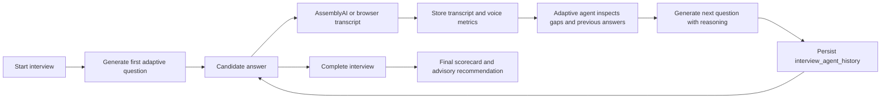

# Adaptive Interview Agent Architecture

## Purpose

The Adaptive Interview Agent converts the previous fixed-question flow into a dynamic interview. It generates one question at a time from job description, resume, transcript, skill gaps, and voice metrics.

The final recommendation remains advisory.

## API

Authenticated HR flow:

```text
POST /interviews/{session_id}/next-question
```

Public candidate flow:

```text
POST /interviews/public/{session_id}/next-question
```

## Existing Flow Reused

- `POST /interviews/start` still creates an interview session.
- `POST /interviews/{session_id}/voice-answer` still uses AssemblyAI.
- Browser speech fallback still works.
- `POST /interviews/{session_id}/complete` still runs final AI evaluation.
- WebSockets still publish interview updates.

## New Behavior

1. Start interview creates only the first adaptive question.
2. Candidate answers by typing or speaking.
3. Answer is stored in the existing transcript.
4. Agent reads transcript, resume, job, skill gaps, and voice metrics.
5. Agent appends the next question to `session.questions`.
6. Each generated question is stored in `interview_agent_history`.

## Question Types

- Technical
- Behavioral
- Problem Solving
- Project Deep Dive
- Leadership

## Data Flow



## Audit Trail

`interview_agent_history` stores:

- question
- answer available at the time
- reasoning
- next action
- category/focus metadata
- timestamp

## Final Report

The final interview response includes the existing scorecard plus `final_agent_report` inside `interview_metrics`:

- technical score
- communication score
- problem solving score
- project understanding score
- leadership score
- overall recommendation
- human approval required

## Demo Script

1. Start an interview for a candidate.
2. Show that only question 1 is generated initially.
3. Submit an answer.
4. Show the next question and “Question Reasoning”.
5. Give a weak answer for a skill.
6. Show the next question probes a related weakness.
7. Complete the interview and show the final scorecard.
