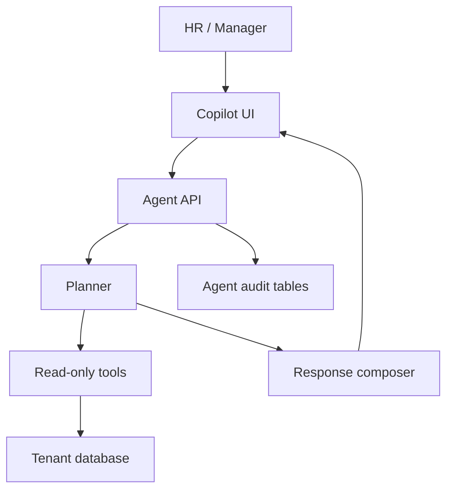

# Agentic AI Explained

## What Agentic AI Means In This Project

Agentic AI in AI Hiring OS means the system can:

- understand a hiring or HR goal
- choose from predefined tools
- fetch live tenant data
- reason over the results
- recommend next actions
- keep an audit trail

It does not mean autonomous hiring.

## Why Not CrewAI, LangGraph, Or AutoGen

This project does not need a heavy multi-agent framework because the product goal is a safe hackathon-ready HR platform, not an open-ended autonomous system.

| Framework | Why not used |
| --- | --- |
| CrewAI | Adds framework complexity for a small read-only tool registry |
| LangGraph | Useful for complex graph state machines, but overkill for this MVP |
| AutoGen | Built for multi-agent conversations, not needed for controlled HR workflows |

## Chosen Approach

The implementation uses a simple custom planner and tool registry:

- predictable
- easy to explain to judges
- easy to audit
- low dependency risk
- compatible with existing FastAPI services

## Agentic Features Implemented

| Feature | Agentic behavior |
| --- | --- |
| Recruiter Copilot | Chooses tools, compares candidates, recommends next actions |
| Adaptive Interview | Generates next question from transcript, gaps, resume, and voice metrics |
| Audit tables | Stores tool calls and question reasoning |
| WebSocket events | Shows agent activity live |
| Candidate insights | Explains ranking, readiness, risk, and next action |

## Human Control

The agent can:

- recommend
- explain
- compare
- summarize
- suggest actions

The agent cannot:

- hire candidates
- reject candidates
- approve payroll
- change employee data
- make final decisions

## Architecture Summary

## Judge-Friendly Explanation

AI Hiring OS is not just using AI for text generation. It now has controlled agentic workflows where AI chooses tools, inspects real hiring data, adapts interview questions, and records its reasoning. The system remains safe because all tools are read-only and all decisions require human approval.
