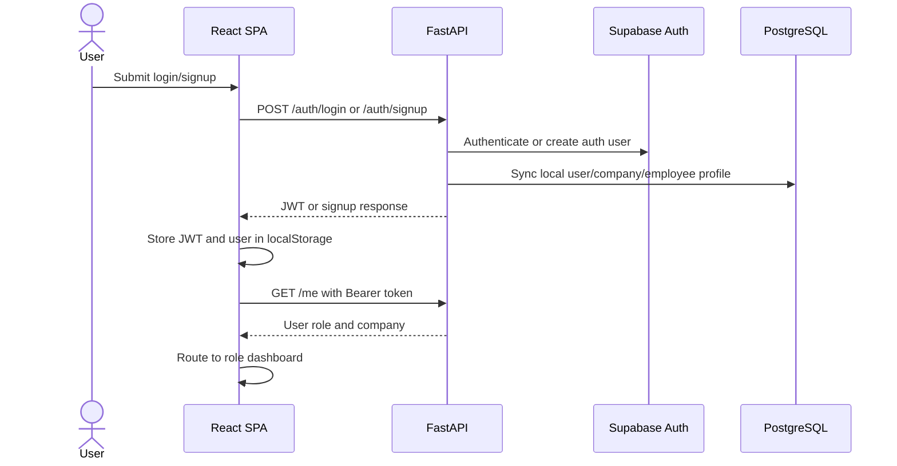
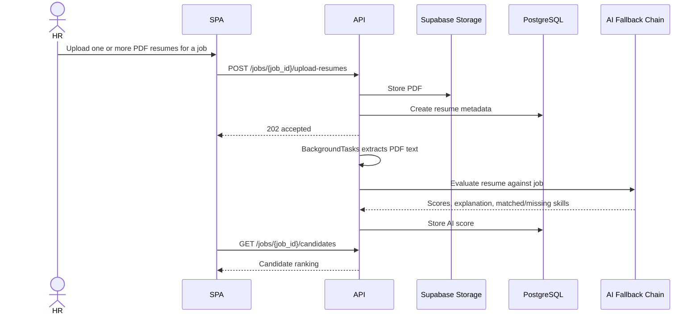
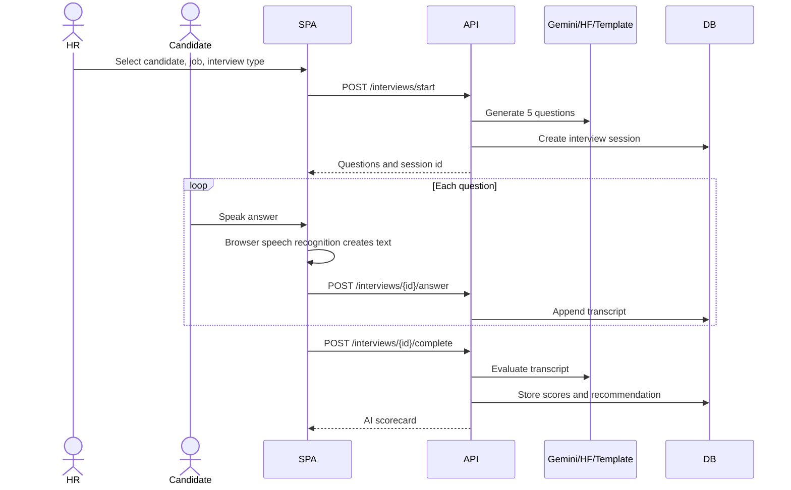
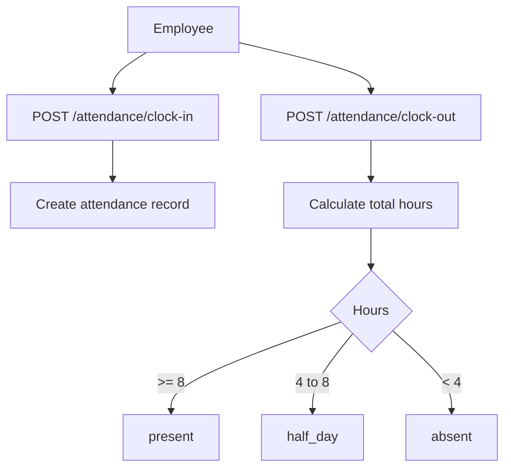
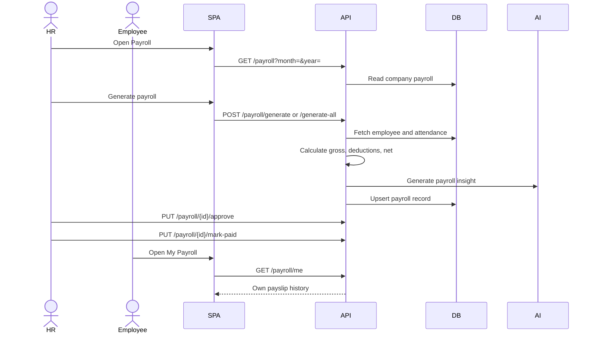
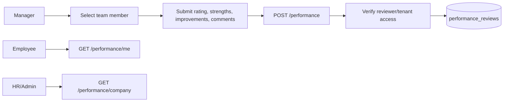
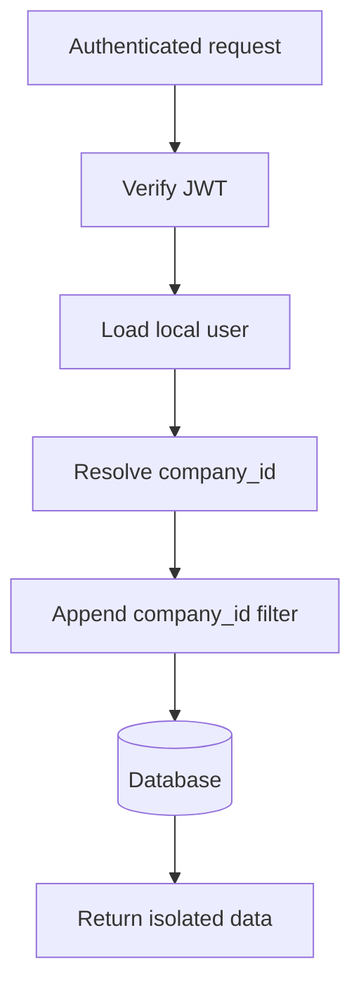

# Application Flow Architecture

## 1. Authentication and Role Routing

## 2. Resume Screening Flow

## 3. AI Interview Flow

## 4. Attendance Flow

## 5. Payroll Flow

## 6. Performance Flow

## 7. Tenant Isolation Flow

