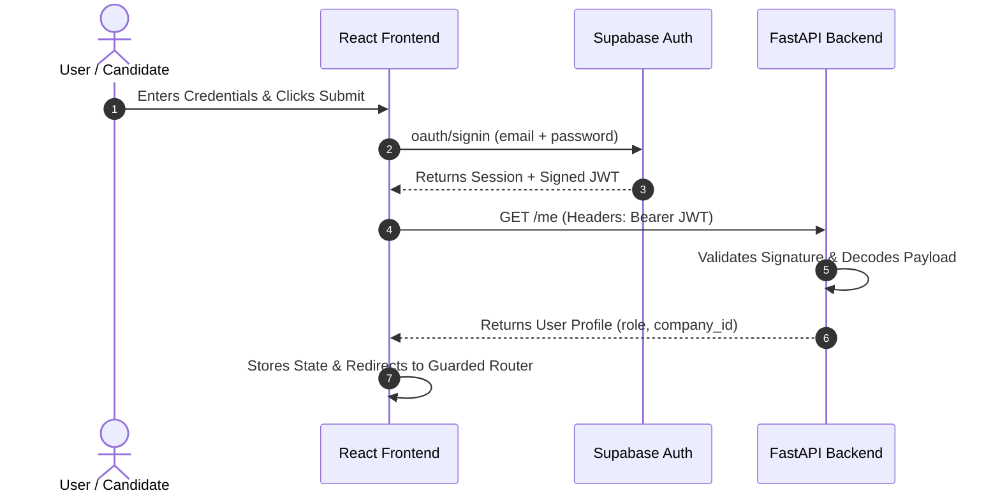
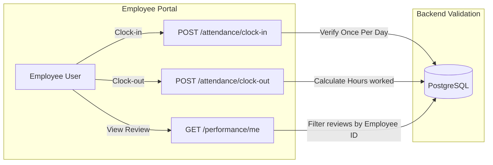
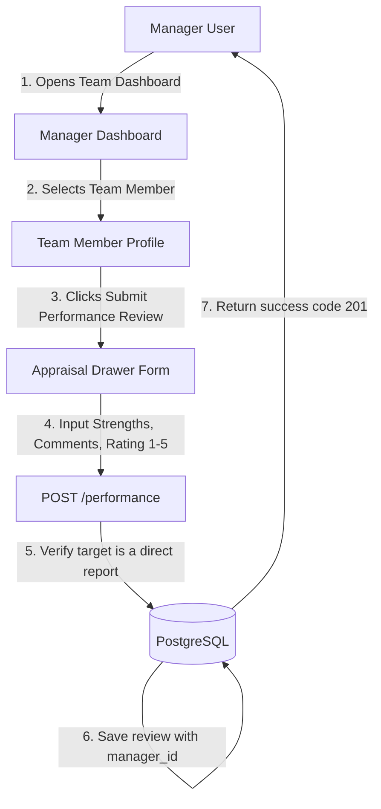
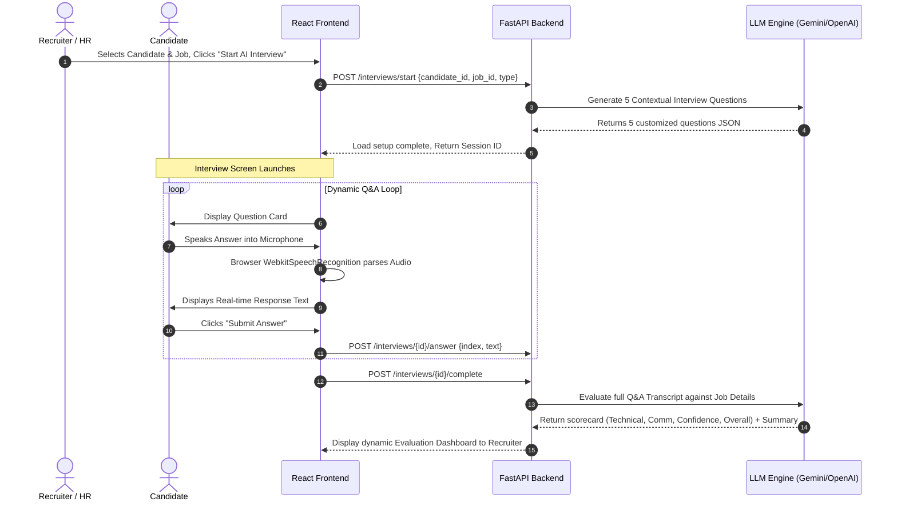
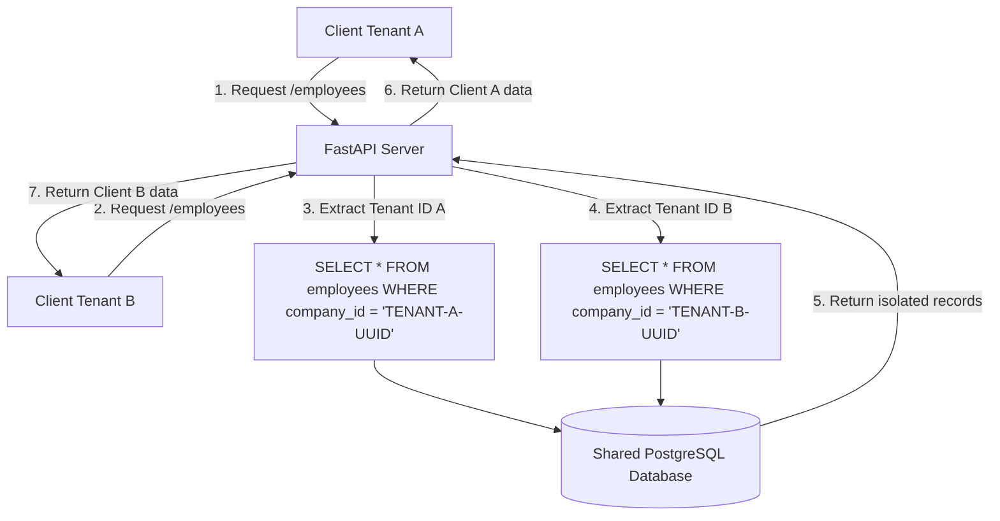

# Application Flow Architecture

This document maps the user journeys, authentication loops, dynamic data queries, and AI processing pipelines within AI Hiring OS using structured visual flows.

---

## 1. Authentication Flow

This flow handles user registration, company binding, secure sign-in, and role-based redirect routes.



---

## 2. Recruitment & Resume Screening Flow

HR professionals can upload resumes and trigger the AI candidate scoring pipeline.

```mermaid
graph TD
    HR[HR Specialist] -->|1. Creates Position| JobsPage[Jobs Directory]
    JobsPage -->|2. Clicks Upload Resumes| Dropzone[Drag & Drop PDF Portal]
    Dropzone -->|3. Sends PDF File| API[FastAPI Upload Route]
    
    subgraph Asynchronous Backend Worker
        API -->|4. Saves File| Storage[Supabase S3 Bucket]
        API -->|5. Triggers Parsing| AIProcessor[Extraction Service]
        AIProcessor -->|6. Call Gemini/OpenAI| LLM[LLM Parser Chain]
        LLM -->|7. Parses JSON Metrics| Scorecard[AI Score Engine]
        Scorecard -->|8. Saves Record| DB[(PostgreSQL database)]
    end

    DB -->|9. Poll Status (200)| SPA[React Candidates Board]
    SPA -->|10. Display AI Scores & Explanation| HR
```

---

## 3. Employee Portal Flow (Attendance & Performance)

This flow maps daily employee clock-in/out procedures and how their performance scorecards are reviewed.



---

## 4. Manager Portal Flow (Appraisal Scorecard)

This flow illustrates how managers review their team's performance and log continuous appraisals.



---

## 5. End-to-End AI Interview Flow

The full workflow of setting up and completing an AI-conducted voice screening session.



---

## 6. Multi-Tenant Row Isolation Flow

To prevent data leaks, the system enforces multi-tenant row isolation across all database queries.


