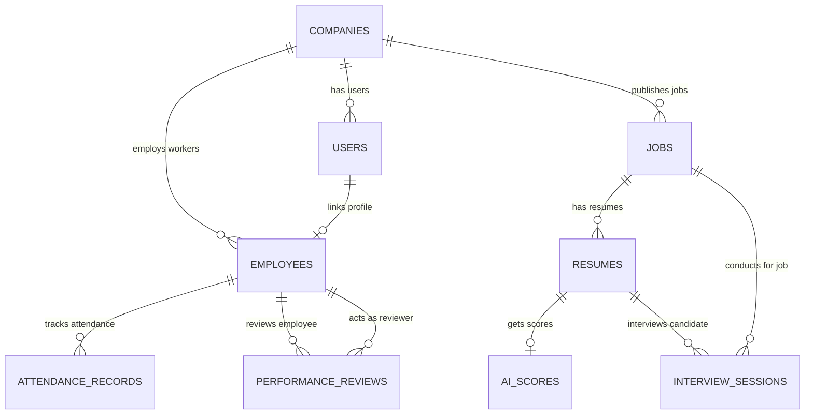

# Backend Database Schema Blueprint

This document details the database architecture of AI Hiring OS, mapping the relational schema, constraints, indexing strategies, foreign key constraints, and multi-tenant row-isolation designs that power the platform.

---

## 1. Entity Relationship (ER) Diagram



---

## 2. Table Specifications

### 2.1 Table: `companies`
Stores core tenant accounts. Everything else in the database relates to this table.

*   **Primary Key**: `id` (UUID, Auto-generated)
*   **Properties**:
    *   `name`: `VARCHAR(255)` (Unique, Required)
    *   `description`: `TEXT` (Optional)
    *   `website`: `VARCHAR(255)` (Optional)
    *   `location`: `VARCHAR(255)` (Optional)
    *   `industry`: `VARCHAR(255)` (Optional)
    *   `employee_count_range`: `VARCHAR(50)` (Optional)
    *   `contact_email`: `VARCHAR(255)` (Optional)
    *   `created_at`: `TIMESTAMP WITH TIME ZONE` (Default: `now()`)

---

### 2.2 Table: `users`
Saves verified user login records and links them to platforms.

*   **Primary Key**: `id` (UUID, Auto-generated)
*   **Properties**:
    *   `supabase_uid`: `UUID` (Unique, links directly to Supabase authentication)
    *   `company_id`: `UUID` (Foreign Key → `companies.id`, Row isolated)
    *   `email`: `VARCHAR(255)` (Unique, Required)
    *   `name`: `VARCHAR(255)` (Required)
    *   `role`: `VARCHAR(50)` (Role enum: `admin`, `hr`, `manager`, `employee`)
    *   `created_at`: `TIMESTAMP WITH TIME ZONE` (Default: `now()`)
*   **Indexes**:
    *   `idx_users_company`: ON `company_id`
    *   `idx_users_email`: ON `email`

---

### 2.3 Table: `employees`
Tracks workforce directories, roles, reporting lines, and linked credentials.

*   **Primary Key**: `id` (UUID, Auto-generated)
*   **Properties**:
    *   `company_id`: `UUID` (Foreign Key → `companies.id`, Row isolated)
    *   `user_id`: `UUID` (Foreign Key → `users.id`, Nullable, link to login profile)
    *   `employee_code`: `VARCHAR(50)` (Unique per company)
    *   `full_name`: `VARCHAR(255)` (Required)
    *   `email`: `VARCHAR(255)` (Required)
    *   `phone`: `VARCHAR(50)` (Optional)
    *   `department`: `VARCHAR(255)` (Required)
    *   `designation`: `VARCHAR(255)` (Required)
    *   `manager_id`: `UUID` (Self-referencing Foreign Key → `employees.id`, Nullable)
    *   `joining_date`: `DATE` (Required)
    *   `employment_type`: `VARCHAR(50)` (`full_time`, `part_time`, `contract`, `intern`)
    *   `status`: `VARCHAR(50)` (Default: `active`, can be `inactive` or `terminated`)
    *   `profile_photo`: `TEXT` (Optional profile picture link)
    *   `created_at`: `TIMESTAMP WITH TIME ZONE` (Default: `now()`)
*   **Indexes**:
    *   `idx_employees_company`: ON `company_id`
    *   `idx_employees_dept`: ON `department`

---

### 2.4 Table: `jobs`
Maintains vacancy listings created by HR and Recruiters.

*   **Primary Key**: `id` (UUID, Auto-generated)
*   **Properties**:
    *   `company_id`: `UUID` (Foreign Key → `companies.id`, Row isolated)
    *   `title`: `VARCHAR(255)` (Required)
    *   `description`: `TEXT` (Required)
    *   `requirements`: `TEXT` (Required)
    *   `location`: `VARCHAR(255)` (Optional)
    *   `salary`: `VARCHAR(100)` (Optional)
    *   `created_at`: `TIMESTAMP WITH TIME ZONE` (Default: `now()`)
*   **Indexes**:
    *   `idx_jobs_company`: ON `company_id`

---

### 2.5 Table: `resumes`
Tracks candidate applications and extracted CV details.

*   **Primary Key**: `id` (UUID, Auto-generated)
*   **Properties**:
    *   `company_id`: `UUID` (Foreign Key → `companies.id`, Row isolated)
    *   `job_id`: `UUID` (Foreign Key → `jobs.id`)
    *   `file_name`: `VARCHAR(255)` (Required)
    *   `storage_path`: `VARCHAR(555)` (Required storage URL)
    *   `candidate_name`: `VARCHAR(255)` (Default: `Extracting...`)
    *   `status`: `VARCHAR(50)` (Default: `pending`, can be `processing`, `completed`, or `failed`)
    *   `created_at`: `TIMESTAMP WITH TIME ZONE` (Default: `now()`)
*   **Indexes**:
    *   `idx_resumes_job`: ON `job_id`

---

### 2.6 Table: `ai_scores`
Calculates and stores match ratings generated by AI screening routines.

*   **Primary Key**: `id` (UUID, Auto-generated)
*   **Properties**:
    *   `resume_id`: `UUID` (Foreign Key → `resumes.id`, Unique)
    *   `skill_match_score`: `INTEGER` (0 to 100)
    *   `semantic_score`: `INTEGER` (0 to 100)
    *   `overall_score`: `INTEGER` (0 to 100)
    *   `explanation`: `TEXT` (Summarized AI evaluation justification)
    *   `matched_skills`: `JSON` (List of matched skill tags)
    *   `missing_skills`: `JSON` (List of missing skill tags)
    *   `created_at`: `TIMESTAMP WITH TIME ZONE` (Default: `now()`)

---

### 2.7 Table: `attendance_records`
Logs employee check-ins and active hours.

*   **Primary Key**: `id` (UUID, Auto-generated)
*   **Properties**:
    *   `company_id`: `UUID` (Foreign Key → `companies.id`, Row isolated)
    *   `employee_id`: `UUID` (Foreign Key → `employees.id`)
    *   `clock_in`: `TIMESTAMP WITH TIME ZONE` (Required)
    *   `clock_out`: `TIMESTAMP WITH TIME ZONE` (Nullable)
    *   `total_hours`: `DOUBLE PRECISION` (Nullable)
    *   `attendance_date`: `DATE` (Required)
    *   `status`: `VARCHAR(50)` (`present`, `half_day`, `absent`)
*   **Constraints**:
    *   `uq_employee_date`: Unique constraint on `(employee_id, attendance_date)`
*   **Indexes**:
    *   `idx_attendance_company_date`: ON `(company_id, attendance_date)`

---

### 2.8 Table: `performance_reviews`
Records periodic performance ratings logged by team managers.

*   **Primary Key**: `id` (UUID, Auto-generated)
*   **Properties**:
    *   `company_id`: `UUID` (Foreign Key → `companies.id`, Row isolated)
    *   `employee_id`: `UUID` (Foreign Key → `employees.id`)
    *   `reviewer_id`: `UUID` (Foreign Key → `employees.id` (Manager))
    *   `rating`: `DOUBLE PRECISION` (Range: 1.0 to 5.0)
    *   `strengths`: `TEXT` (Required)
    *   `improvements`: `TEXT` (Required)
    *   `comments`: `TEXT` (Required)
    *   `review_date`: `DATE` (Required)
    *   `created_at`: `TIMESTAMP WITH TIME ZONE` (Default: `now()`)
*   **Indexes**:
    *   `idx_reviews_employee`: ON `employee_id`

---

### 2.9 Table: `interview_sessions`
Maintains histories and scorecards for AI interview sessions.

*   **Primary Key**: `id` (UUID, Auto-generated)
*   **Properties**:
    *   `company_id`: `UUID` (Foreign Key → `companies.id`, Row isolated)
    *   `candidate_id`: `UUID` (Foreign Key → `resumes.id`)
    *   `job_id`: `UUID` (Foreign Key → `jobs.id`)
    *   `interview_type`: `VARCHAR(50)` (`technical`, `behavioral`, `general`)
    *   `status`: `VARCHAR(50)` (Default: `pending`, can be `in_progress` or `completed`)
    *   `questions`: `JSON` (List of generated questions)
    *   `transcript`: `JSON` (Captured Q&A exchange history list)
    *   `ai_summary`: `TEXT` (Nullable)
    *   `technical_score`: `DOUBLE PRECISION` (0.0 to 100.0)
    *   `communication_score`: `DOUBLE PRECISION` (0.0 to 100.0)
    *   `confidence_score`: `DOUBLE PRECISION` (0.0 to 100.0)
    *   `overall_score`: `DOUBLE PRECISION` (0.0 to 100.0)
    *   `recommendation`: `VARCHAR(50)` (`strong_hire`, `hire`, `consider`, `reject`)
    *   `created_at`: `TIMESTAMP WITH TIME ZONE` (Default: `now()`)

---

## 3. Row-Level Tenant Isolation Design
To ensure secure data isolation in a multi-tenant environment, the database implements a strict row-level isolation strategy:

```
[Incoming HTTP Client Request] 
      │ 
      ▼
[Reads JWT from Bearer Header]
      │
      ▼
[API Extract claims: company_id = 'COMP-ALPHA-UUID']
      │
      ▼
[FastAPI dynamically appends filter condition to raw/ORM query]
   SELECT * FROM employees 
   WHERE company_id = 'COMP-ALPHA-UUID' AND status = 'active';
```

All dynamic services dynamically fetch the active `company_id` parameter directly from validated token payloads, ensuring users can never read, modify, or delete cross-tenant data.
