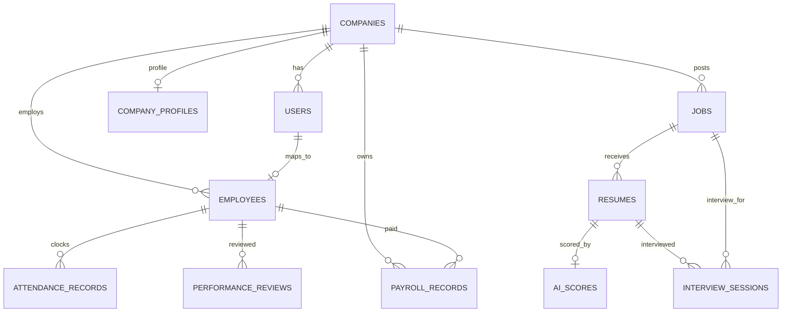

# Backend Schema and API Reference

## 1. Database Tables

| Table | Purpose | Key Relationships |
|---|---|---|
| `companies` | Tenant company | Has users, jobs, employees, profile, payroll records |
| `company_profiles` | Extended company settings | One-to-one with company |
| `users` | Local app user linked to Supabase Auth | Belongs to company, optional employee profile |
| `jobs` | Job postings | Belongs to company and creator user |
| `resumes` | Uploaded candidate resumes | Belongs to job |
| `ai_scores` | Candidate AI evaluation | One-to-one with resume |
| `employees` | Employee directory records | Belongs to company, optional user, optional manager |
| `attendance_records` | Daily clock records | Belongs to company and employee |
| `performance_reviews` | Manager performance reviews | Belongs to company, employee, reviewer |
| `interview_sessions` | AI interview sessions | Belongs to company, candidate resume, job |
| `payroll_records` | Monthly payroll records | Belongs to company and employee |

## 2. ER Diagram

## 3. Important Columns

### `users`

| Column | Notes |
|---|---|
| `id` | UUID primary key |
| `email` | Unique email |
| `name` | Display name |
| `role` | `admin`, `hr`, `manager`, `employee` |
| `company_id` | Tenant key |
| `supabase_uid` | Links to Supabase Auth user |
| `is_active` | Invited/active state |

### `employees`

| Column | Notes |
|---|---|
| `company_id` | Tenant key |
| `user_id` | Optional link to local user |
| `employee_code` | Generated employee identifier |
| `department`, `designation` | Org metadata. In the UI, `designation` is shown as the employee role; HR/admin and manager signup do not require it. |
| `manager_id` | Self-reference for team hierarchy |
| `status` | `active`, `inactive`, `terminated` |

### `attendance_records`

| Column | Notes |
|---|---|
| `employee_id`, `company_id` | Ownership |
| `clock_in`, `clock_out` | Time tracking |
| `total_hours` | Calculated on clock-out |
| `attendance_date` | Unique per employee per date |
| `status` | `present`, `half_day`, `absent` |

### `payroll_records`

| Column | Notes |
|---|---|
| `employee_id`, `company_id` | Ownership |
| `month`, `year` | Payroll period |
| `base_salary` | Input monthly salary |
| `present_days`, `half_days`, `absent_days`, `working_days` | Attendance-derived values |
| `gross_salary`, `deductions`, `net_salary` | Calculated salary values |
| `status` | `draft`, `generated`, `approved`, `paid` |
| `ai_summary` | AI/template payroll summary |
| `generated_at`, `approved_at` | Workflow timestamps |

Unique payroll constraint: `(employee_id, month, year)`.

## 4. API Security Summary

| API Group | Tenant Rule | Role Rule |
|---|---|---|
| Jobs | Job must belong to current company | Create/upload HR/Admin, list Manager+ |
| Candidates | Parent job must belong to current company | Manager+ |
| Employees | Filter by company, manager team, or own profile | HR/Admin write, Manager team read, Employee self read |
| Attendance | Employee profile must belong to company | All own, Manager team, HR/Admin company |
| Performance | Company/team/self checks | Manager submit, HR/Admin company analytics |
| Payroll | Payroll record company and employee checks | HR/Admin write, Manager read-only, Employee own only |
| Interviews | Session/candidate company checks | HR/Admin write, Manager read |

## 5. Startup Behavior

`backend/app/main.py` imports `app.models` and calls `Base.metadata.create_all` during startup. This creates missing tables automatically for development/demo deployments. Alembic is installed but a migration history is not currently implemented.
