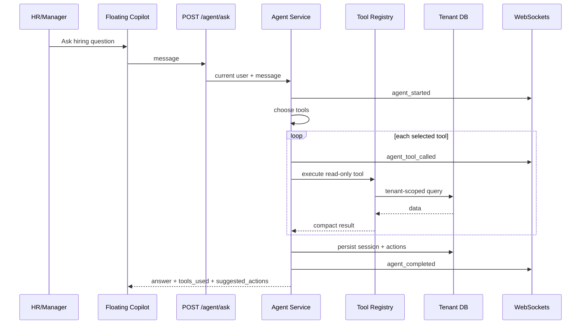

# Recruiter Copilot Architecture

## Purpose

The Recruiter Copilot is a practical agentic AI layer for HR and managers. It answers hiring and HR operations questions by selecting read-only tools, fetching tenant-scoped data, and returning explainable recommendations.

It never hires, rejects, approves payroll, or modifies employee records.

## API

`POST /agent/ask`

Request:

```json
{
  "message": "Show me top candidates for Backend Engineer"
}
```

Response:

```json
{
  "answer": "Here is the advisory hiring plan...",
  "tools_used": ["list_jobs", "list_candidates", "compare_candidates", "recommend_shortlist"],
  "suggested_actions": []
}
```

## Components

| File | Responsibility |
| --- | --- |
| `backend/app/api/routes/agent.py` | FastAPI route and RBAC guard |
| `backend/app/schemas/agent.py` | Request/response contracts |
| `backend/app/services/agent_service.py` | Agent planner, tool execution, trace persistence, response composition |
| `backend/app/services/agent_tools.py` | Read-only tenant-scoped tool registry |
| `backend/app/models/agent.py` | Agent sessions and action audit trail |
| `frontend/src/components/RecruiterCopilot.jsx` | Floating chat UI for HR and manager dashboards |

## Tool Registry

| Tool | Purpose |
| --- | --- |
| `list_jobs` | Lists tenant jobs and candidate counts |
| `get_job_details` | Gets one job description and metadata |
| `list_candidates` | Lists candidates with scores, Candidate Intelligence, ATS signals, skill gaps, and interview status |
| `get_candidate_profile` | Gets resume, scores, Candidate Intelligence, ATS/project/GitHub/portfolio signals, gaps, and interview summary for one candidate |
| `compare_candidates` | Ranks candidates using resume, Candidate Intelligence, and interview evidence |
| `recommend_shortlist` | Produces advisory shortlist and manual-review buckets |
| `get_interview_results` | Summarizes interview scorecards and voice metrics |
| `get_employee_stats` | Summarizes employee, attendance, and performance stats |
| `get_payroll_summary` | Summarizes payroll without changing payroll state |

When recruiter-facing candidate context is available, the copilot receives Candidate Intelligence Score, ATS score, project analysis, GitHub analysis, portfolio analysis, hiring recommendation, strengths, weaknesses, and interview focus areas. It uses those signals for ranking, shortlist advice, manual-review suggestions, and interview planning.

## Data Flow



## Why This Is Agentic

The copilot is agentic because it does more than generate text. It interprets a user goal, selects tools, executes those tools, combines evidence, and returns next-step recommendations.

It is intentionally not fully autonomous. Human users remain responsible for decisions.

## Safety Controls

- RBAC: only admin, HR, and manager users can call `/agent/ask`.
- Tenant isolation: every tool filters by `company_id`.
- Read-only tools: no writes to candidate, employee, or payroll state.
- Audit trail: `agent_sessions` and `agent_actions` store full traces.
- Human control: suggested actions are advisory and require UI/user execution.

## Demo Script

1. Open HR or Manager dashboard.
2. Click the floating copilot button.
3. Ask: `Show me top candidates`.
4. Show `tools_used`.
5. Ask: `Which candidates need manual review?`.
6. Explain that the agent can recommend but cannot reject or hire.
