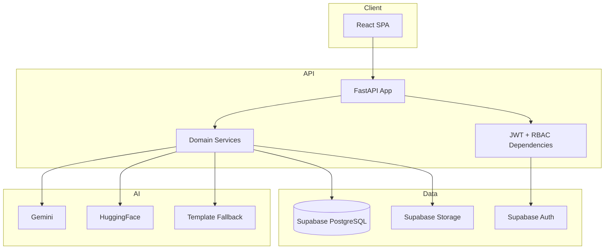
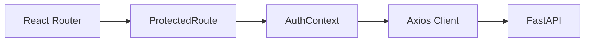
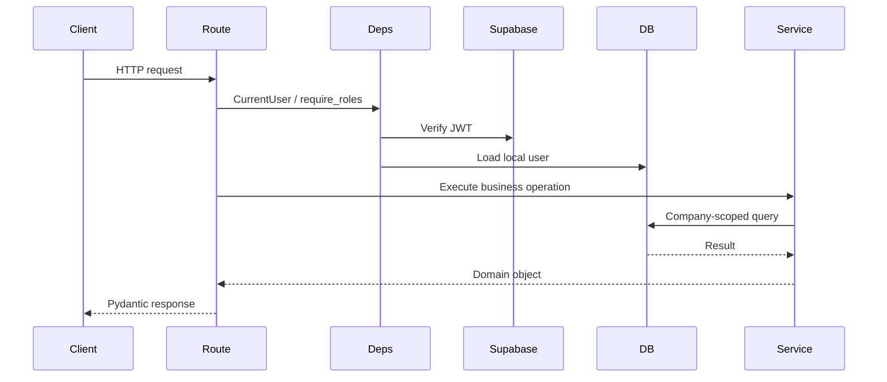
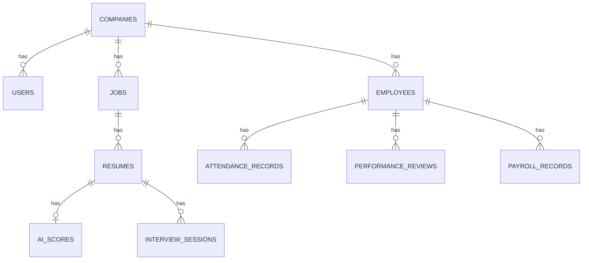
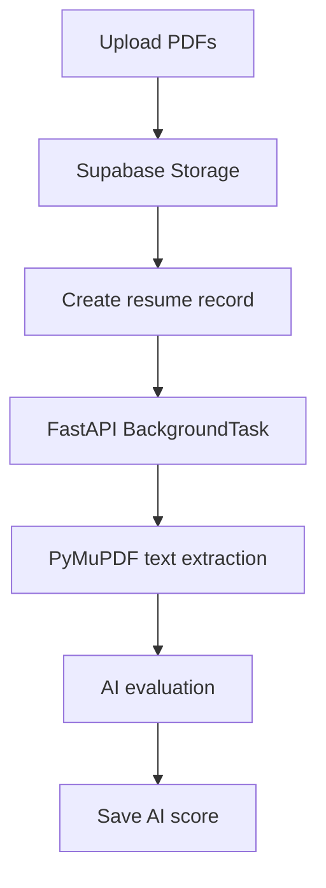
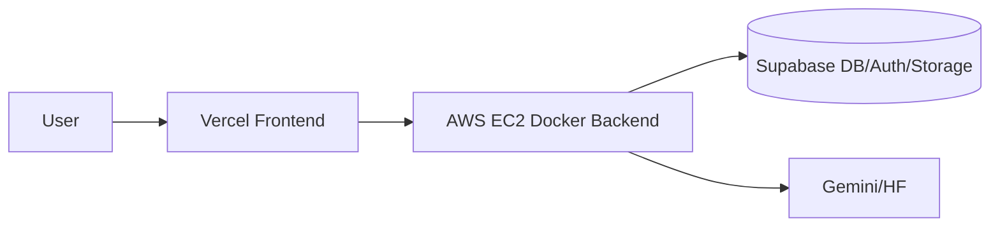

# System Design Deep Dive

## 1. Product Overview

AI Hiring OS combines ATS-style recruitment automation with HRMS operations. The product handles job creation, resume upload, AI screening, AI interview sessions, employee records, attendance, payroll, and performance reviews.

## 2. High-Level Architecture



## 3. Frontend Architecture

The frontend is a Vite React SPA. `App.jsx` defines role-protected routes. `AuthContext.jsx` stores and refreshes local user state. `api.js` injects JWT tokens into every request.



## 4. Backend Architecture

FastAPI routes are grouped by domain. Each route delegates business logic to a service module. SQLAlchemy async sessions are injected per request.



## 5. Database Architecture

The schema is relational. Company-level tenancy is represented by `company_id`. Payroll and attendance are directly connected to employees. Resume screening connects jobs, resumes, and AI scores.



## 6. Authentication and Authorization

Authentication is delegated to Supabase Auth. Authorization is enforced in FastAPI through `CurrentUser`, `require_roles`, and domain checks.

| Role | Access Pattern |
|---|---|
| Admin | Full company-scoped access |
| HR | Full HR operations |
| Manager | Candidate read, team/analytics views, payroll read-only |
| Employee | Own attendance/performance/payroll/profile data |

## 7. Tenant Isolation Strategy

Tenant isolation is implemented by:

1. Resolving the local user from the verified Supabase JWT.
2. Reading `current_user.company_id`.
3. Filtering list/detail queries by `company_id`.
4. Checking parent ownership before child access.
5. Restricting employee routes to own profile for employee role.

## 8. AI Architecture

AI workflows use a fallback chain:

1. Try Gemini when configured.
2. Try HuggingFace Router when configured.
3. Use deterministic template fallback.

This pattern exists for resume insights, interviews, and payroll summaries.

## 9. Resume Processing Pipeline



## 10. Candidate Scoring Pipeline

The scoring pipeline compares resume text to job description/requirements and persists `skill_match_score`, `semantic_score`, `overall_score`, `explanation`, `matched_skills`, and `missing_skills`.

## 11. AI Interview Pipeline

The interview pipeline generates five questions, records answers, and evaluates the completed transcript into technical, communication, confidence, and overall scores.

## 12. Attendance Pipeline

Clock-out calculates hours. Attendance status is derived as:

| Hours | Status |
|---|---|
| `>= 8` | `present` |
| `>= 4 and < 8` | `half_day` |
| `< 4` | `absent` |

## 13. Payroll Pipeline

Payroll generation reads attendance for the selected employee and period. It calculates:

```text
daily_salary = base_salary / working_days
absence_penalty = daily_salary * absent_days
half_day_penalty = daily_salary * 0.5 * half_days
deductions = absence_penalty + half_day_penalty
net_salary = base_salary - deductions
```

Records then move through `generated`, `approved`, and `paid`.

## 14. Performance Pipeline

Managers submit reviews for employees. Employees can read their own reviews. HR/Admin can read company analytics.

## 15. Dashboard Data Flow

Each dashboard pulls data from multiple endpoints:

| Dashboard | Data Sources |
|---|---|
| HR | jobs, candidates, employees, attendance, performance, interviews, payroll, company |
| Manager | jobs, candidates, attendance/team, performance/team, payroll |
| Employee | company, employees self profile, attendance/me, performance/me, payroll/me |

## 16. Error Handling

Frontend errors are surfaced through toast notifications. Backend errors use FastAPI `HTTPException` with role, tenant, validation, and business rule messages.

## 17. Security Design

Security controls include JWT verification, role checks, tenant filters, Supabase service role only on backend, CORS allowlist, and password/auth handled by Supabase.

## 18. Scalability Design

| Area | Current Scalability Design |
|---|---|
| Frontend | Static SPA deployed through Vercel |
| Backend | Stateless FastAPI container, horizontally scalable |
| Database | PostgreSQL indexes and Supabase pooler support |
| Files | Supabase Storage |
| AI | Provider fallback chain |

Remaining scale work: load testing, durable queues, Redis/cache, observability, formal migrations.

## 19. Deployment Architecture


