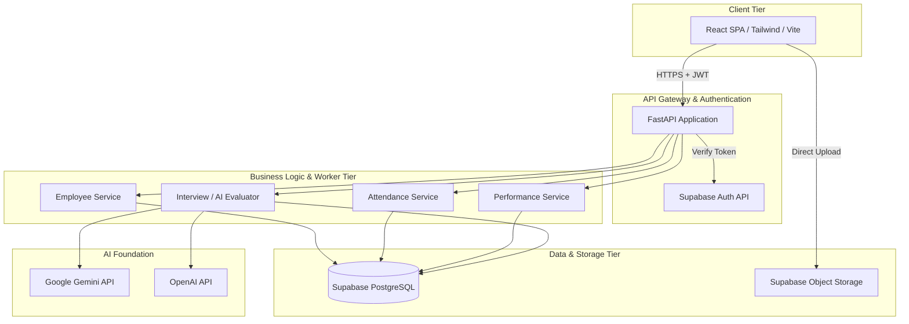
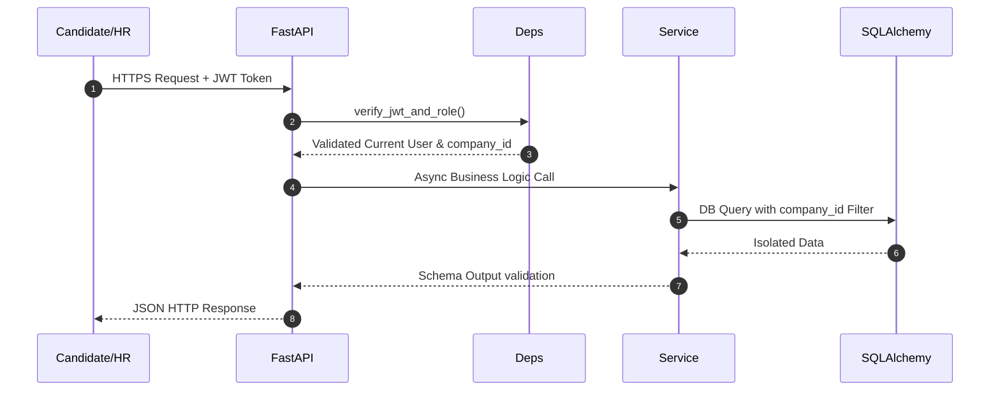
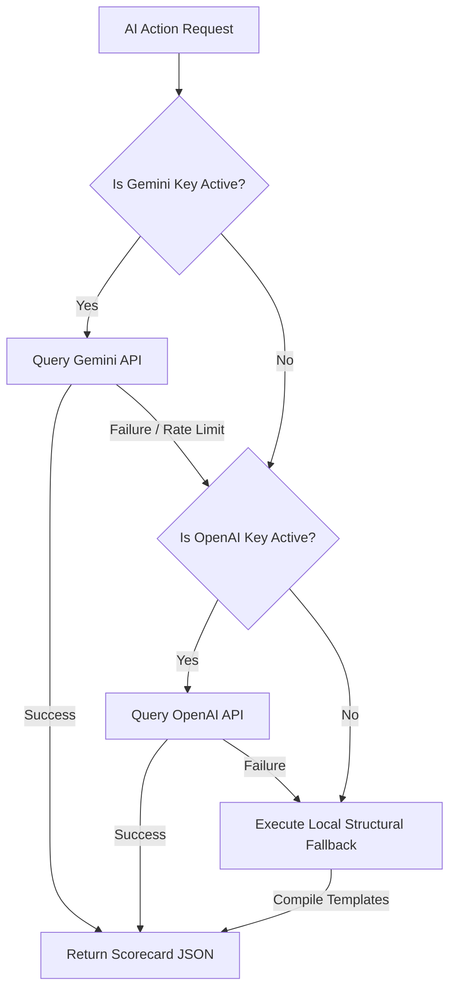

# Technical Requirements Document (TRD)

## 1. Technical Overview
AI Hiring OS is a modern multi-tenant SaaS platform leveraging high-performance, asynchronous REST APIs backed by a secure relational database. The frontend is engineered as a responsive Single Page Application (SPA), while the backend handles authentication, business logic, tenant isolation, and AI integrations.

---

## 2. System Architecture

---

## 3. Frontend Architecture
The client tier is engineered with **React (18+)** and bundled via **Vite** for optimized assets compilation.

*   **State Management**: Context-based global authentication manager (`AuthContext.jsx`) coupled with React Hook States for isolated page-level parameters.
*   **Routing Hierarchy**: Implements role-aware guarded routing blocks using `react-router-dom` to enforce route protections.
*   **Style Framework**: Custom-styled layout utilizing pure **TailwindCSS** for responsive structures. Enhanced with micro-animations powered by **Framer Motion**.
*   **API Client**: Axios instance configured with global request interceptors that inject Bearer JWT authorization headers, with response interceptors to automatically handle token renewals.

---

## 4. Backend Architecture
The backend is powered by **FastAPI**, achieving high concurrency via Python's `asyncio` loop.

*   **Database ORM**: SQLAlchemy using `asyncpg` drivers for non-blocking database queries.
*   **Tenant Separation**: Sub-queries dynamically extract the `company_id` directly from validated Supabase JWT payloads, appending isolation filters onto every database access.
*   **Access Guards (RBAC)**: Custom FastAPI dependencies (`require_roles`) enforce role checks before route execution.

---

## 5. AI & LLM Architecture

The AI module uses a robust, schema-driven evaluation flow to score applicants and run dynamic interviews.

### LLM Chain of Responsibility & Fallback
To ensure complete system reliability even during third-party service outages or API rate-limiting, the AI integration implements a strict multi-provider fallback architecture.

*   **Prompt Engineering**: Leverages strict Pydantic models with schema formats to force LLMs to return consistent JSON objects.
*   **Local Fallback Parser**: If all external APIs are unreachable, a backup parsing engine analyzes the texts and generates structured matching scores, keeping the application online.

---

## 6. Authentication Flow
Supabase is used for user management. When a user authenticates:
1.  The client sends credentials directly to Supabase Auth, receiving a signed JWT.
2.  The client stores the JWT and sends it in the `Authorization: Bearer <JWT>` header of subsequent API requests.
3.  The FastAPI backend decodes the token, validating its signature against Supabase public keys, extracting the user email, role, and linked `company_id` to establish context.

---

## 7. Deployment Architecture
*   **Client Hosting**: Deployed to Vercel/Netlify for low-latency, globally cached asset distribution.
*   **Server Hosting**: Run inside Docker containers deployed on Render, optimizing scale-out performance.
*   **Database Cloud**: Scaled using Supabase managed clusters with auto-growing tables.

---

## 8. API Architecture (Sample Endpoints)

| Method | Endpoint | Access Role | Description |
| :--- | :--- | :--- | :--- |
| `POST` | `/auth/login` | Public | Authenticate user, return JWT and profile details. |
| `POST` | `/jobs` | Admin, HR | Create job position for active tenant. |
| `GET` | `/employees` | HR, Admin (all) / Manager (team) / Employee (self) | Paginated employee listings with dynamic access filters. |
| `POST` | `/attendance/clock-in` | All roles | Clock in once per day. |
| `POST` | `/performance` | Manager | Submit appraisal for a direct report. |
| `POST` | `/interviews/start` | Admin, HR | Setup and start an AI interview session. |

---

## 9. Security Architecture
*   **Data Isolation**: Absolutely no cross-tenant DB sharing. Every query filters dynamically using the validated `company_id` in the JWT payload.
*   **Secret Management**: Sensitive variables (API keys, DB URIs) are loaded strictly through secure environment contexts (`core/config.py`).
*   **CORS Safeguards**: Restricts API interaction to white-listed client URLs.

---

## 10. Scalability Strategy
*   **Database Optimization**: Indexes are defined on columns like `company_id`, `email`, and `department` to keep query execution times low as tables grow.
*   **Stateless Services**: All FastAPI operations run stateless, allowing developers to scale out server instances horizontally behind load balancers.

---

## 11. Monitoring Strategy
*   **Structured Logs**: Python's logging library records system behaviors, database queries, and API latency.
*   **Error Monitoring**: Sentry integration tracks runtime exceptions on both the frontend and backend.

---

## 12. Risks and Mitigation
*   **Risk: Third-party LLM Outage**
    *   *Mitigation*: The platform implements a local structural template parser that handles key operations without calling external APIs.
*   **Risk: Heavy PDF Upload Lag**
    *   *Mitigation*: File uploads are handled asynchronously, enabling instant UI updates while the file processes in the background.
