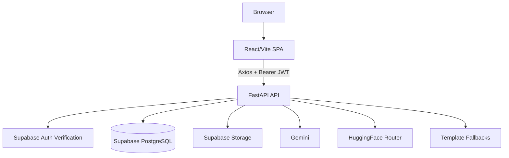
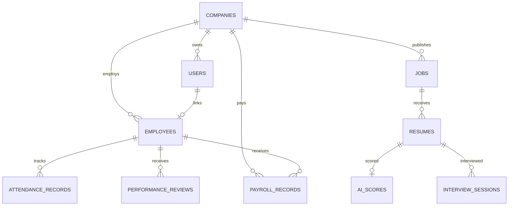
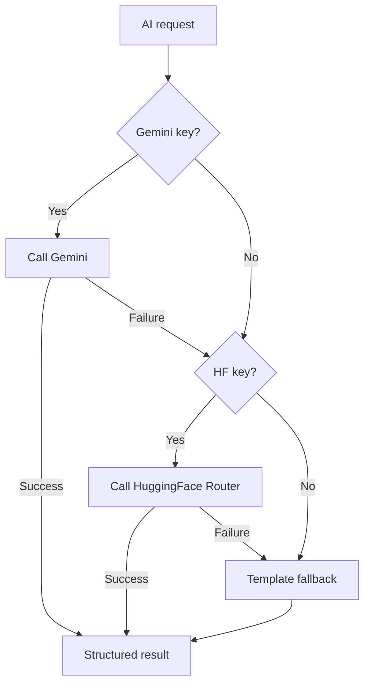

# Technical Requirements Document

## 1. System Overview

AI Hiring OS is implemented as a React single-page application and a FastAPI backend. The backend owns all business logic, Supabase Auth verification, RBAC checks, SQLAlchemy persistence, AI provider calls, resume extraction, and payroll calculation.

## 2. High-Level Architecture

## 3. Backend Architecture

| Layer | Files | Responsibility |
|---|---|---|
| App entry | `backend/app/main.py` | FastAPI app, CORS, router registration, startup table creation |
| Dependencies | `backend/app/api/deps.py` | JWT extraction, current user resolution, RBAC |
| Models | `backend/app/models/*` | SQLAlchemy ORM tables |
| Schemas | `backend/app/schemas/*` | Pydantic request/response contracts |
| Routes | `backend/app/api/routes/*` | HTTP endpoints and access checks |
| Services | `backend/app/services/*` | Business logic and database operations |
| Auth | `backend/app/auth/supabase_auth.py` | Supabase client, sign in, sign up, JWT validation |
| DB | `backend/app/db/session.py` | Async SQLAlchemy engine/session |

## 4. Frontend Architecture

| Layer | Files | Responsibility |
|---|---|---|
| Routing | `frontend/src/App.jsx` | Protected routes by role |
| API client | `frontend/src/services/api.js` | Axios base URL, JWT headers, auth error handling |
| Auth state | `frontend/src/context/AuthContext.jsx` | User/session persistence and login/signup/logout |
| Toasts | `frontend/src/context/ToastContext.jsx` | Global toast notifications |
| Layout | `Sidebar.jsx`, `Topbar.jsx` | Role-aware navigation and dashboard header |
| Pages | `frontend/src/pages/*` | Domain screens |
| Styling | `index.css`, Tailwind config | Apple-inspired neutral theme and responsive utilities |

## 5. Database and Tenant Model

Every major business table includes `company_id` except child records where ownership is reached through parent relationships. The API resolves the current user and company from the JWT/local user record and applies company filtering in services/routes.

## 6. API Architecture

| Group | Endpoints |
|---|---|
| Health | `GET /`, `GET /health` |
| Auth | `POST /auth/login`, `POST /auth/signup` |
| Users | `GET /me`, `GET /users`, `POST /users` |
| Companies | `GET /companies`, `POST /companies`, `GET /companies/{id}`, `PUT /companies/{id}` |
| Jobs | `POST /jobs`, `GET /jobs`, `POST /jobs/{id}/upload-resumes`, `GET /jobs/{id}/candidates` |
| Employees | `POST /employees`, `GET /employees`, `GET /employees/departments`, `GET/PUT/DELETE /employees/{id}` |
| Attendance | `POST /attendance/clock-in`, `POST /attendance/clock-out`, `GET /attendance/me`, `GET /attendance/team`, `GET /attendance/company` |
| Performance | `POST /performance`, `GET /performance/me`, `GET /performance/team`, `GET /performance/company` |
| Interviews | `POST /interviews/start`, `POST /interviews/{id}/answer`, `POST /interviews/{id}/complete`, `GET /interviews/{id}`, `GET /interviews/candidate/{id}`, `GET /interviews/company/analytics` |
| Payroll | `POST /payroll/generate`, `POST /payroll/generate-all`, `GET /payroll`, `GET /payroll/me`, `GET /payroll/{id}`, `PUT /payroll/{id}/approve`, `PUT /payroll/{id}/mark-paid` |

## 7. AI Architecture

Implemented AI paths:

| Feature | Service |
|---|---|
| Resume scoring | `ai_service.py`, `scoring_service.py`, `evaluation_service.py` |
| Interview questions/evaluation | `interview_ai_service.py`, `interview_service.py` |
| Payroll summary | `payroll_service.py` |

## 8. Deployment Architecture

| Environment | Current Repo Support |
|---|---|
| Frontend | Vercel through `vercel.json` with root directory `frontend` |
| Backend active path | AWS EC2 Docker Compose through `docker-compose.aws.yml` |
| Backend legacy path | Render through `render.yaml` |
| Database/Auth/Storage | Supabase |
| Backend HTTPS | Caddy/DuckDNS configured outside repo per deployment notes |

## 9. Technical Risks

| Risk | Current Mitigation | Remaining Work |
|---|---|---|
| Cross-tenant data leakage | company-scoped route/service checks | Add automated tenant isolation tests |
| Background task loss | FastAPI background tasks for resume processing | Add Celery/RQ/Cloud Tasks-style durable workers |
| Schema drift | SQLAlchemy auto-create tables | Add Alembic migrations |
| Large frontend bundle | Vite production build works but warns on chunk size | Add route-level code splitting |
| Secrets exposure | `.env` based config | Rotate exposed keys and use secret manager in production |
# Enterprise Architecture Addendum

## AssemblyAI Integration

`POST /interviews/{session_id}/voice-answer` accepts multipart audio, uploads it to AssemblyAI, polls transcription completion, stores `interview_transcript`, `interview_metrics`, `audio_url`, and merges voice-derived communication/confidence/fluency metrics with existing AI evaluation.

## WebSocket Integration

`/ws?token=<jwt>` authenticates the Supabase JWT, resolves the local user, and subscribes the socket to that user's company. Backend services publish only tenant-scoped events through `realtime_service`.

## Payroll Components

Payroll records now persist explicit component fields and derive gross/net from basic salary, allowances, bonuses, manual deductions, and attendance deductions.
